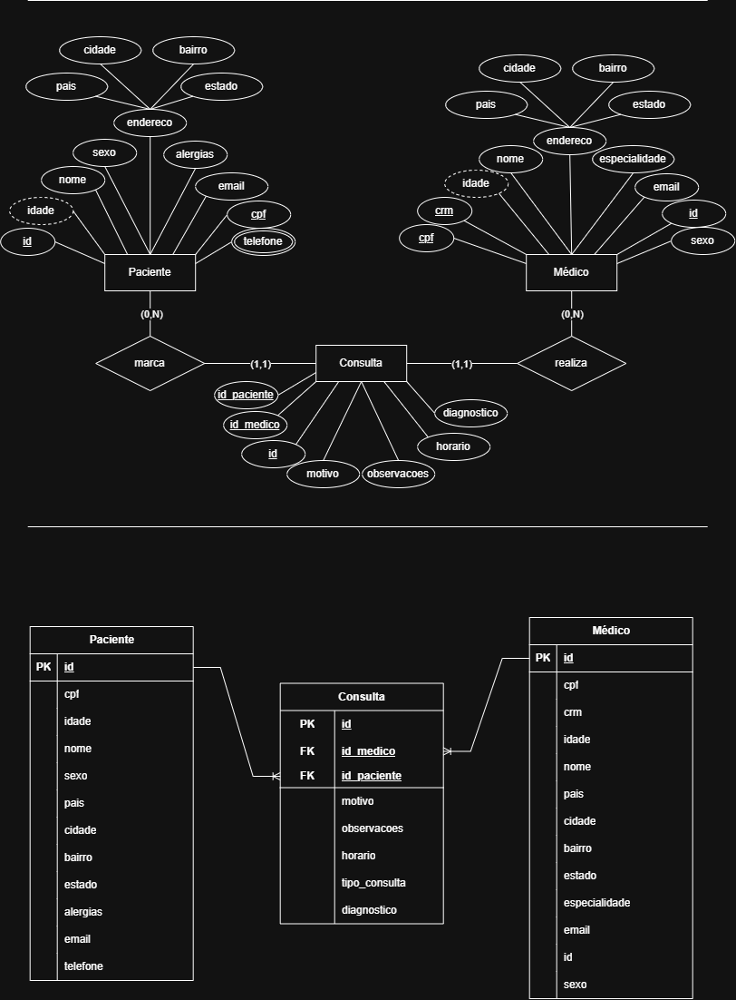

**MER Dicionário de dados, Sistema: Gestão de Pedidos**

| Entidade | Atributo | Tipo | Tamanho | Descrição |
| :--- | :--- | :--- | :--- | :--- |
| Paciente | id | int |  | Chave primária |
| Paciente | cpf | varchar | 11 | CPF do paciente |
| Paciente | idade | int | 3 | idade do paciente |
| Paciente | nome | varchar | 100 | nome do paciente |
| Paciente | sexo | varchar | 1 | sexo do paciente |
| Paciente | pais | varchar | 50 | país em que o paicente nasceu |
| Paciente | cidade | varchar | 50 | ciade em que o paciente nasceu |
| Paciente | bairro | varchar | 50 | bairro em que o paciente nasceu |
| Paciente | estado | varchar | 50 | estado em que o paciente nasceu |
| Paciente | alergias | varchar | 100 | alergias do paciente |
| Paciente | email | varchar | 100 | email pessoal do paciente |
| Paciente | telefone | varchar | 15 | telefone pessoal do paciente |
| Médico | id | int | 11 | Chave primária |
| Médico | cpf | varchar | 11 | CPF do médico |
| Médico | crm | varchar | 15 | CRM do médico |
| Médico | idade | int | 3 | idade do médico |
| Médico | nome | varchar | 100 | nome do médico |
| Médico | sexo | varchar | 1 | sexo do médico |
| Médico | pais | varchar | 50 | país em que o médico nasceu |
| Médico | cidade | varchar | 50 | cidade em que o médico nasceu |
| Médico | bairro | varchar | 50 | bairro em que o médico nasceu |
| Médico | estado | varchar | 2 | estado em que o médico nasceu |
| Médico | especialidade | varchar | 100 | especialidade do médico |
| Médico | email | varchar | 100 | email profissional do médico |
| Consulta | id | int |  | Chave primária |
| Consulta | id_medico | int |  | Chave estrangeira |
| Consulta | id_paciente | int |  | Chave estrangeira |
| Consulta | motivo | varchar | | Motivo da consulta |
| Consulta | observacoes | varchar | | Obersvações da consulta |
| Consulta | horario | date | | Horário do atendimento |
| Consulta | tipo_consulta | varchar | 50 | O tipo da consulta |
| Consulta | diagnostico | varchar | | Diagnóstico final da consulta |

    
  

<a href="Pacientes.CSV">Pacientes.CSV</a>

<a href="Médicos.CSV">Médicos.CSV</a>

<a href="Consultas.CSV">Consultas.CSV</a>

